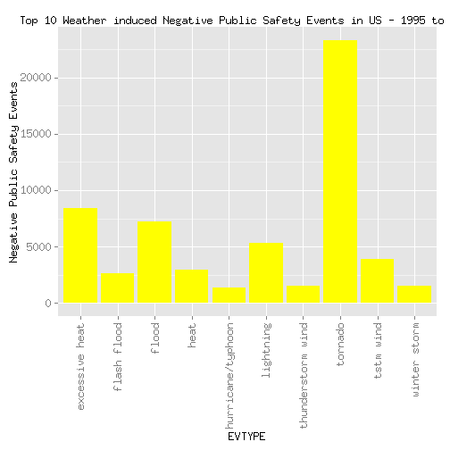
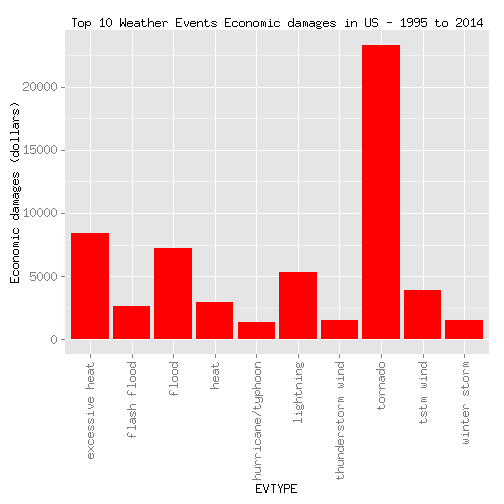

# Title 

Analysis of NOAA weather events for population health effects and economic damage

# Synopsis

From  NOAA storm data for years 1950-2011, an emprical comparison is performed toinvestigate which weathe events are most costly in terms of US dollars and havig most damages to population health. 

Tornado is most detrimetal to public safety.
Hurricane/Typhon is caused most economy damage.

No inflation adjustment in dollars is made. Comparison is later restricted from 1995 to 2014 because of events collections changes, and missing data cannot be treated as zero.

For background of project, please refer to [README.md](https://github.com/linearregression/RepData_PeerAssessment2/blob/master/README.md)

# Data Processing
## Download data from source

```r
rm(list=ls())
targetfile <- 'StormData.csv'
zipData <- paste(targetfile,'.bz2', sep='')

if(!file.exists(zipData)) {
   print('Downloading StormData.zip ....')   
   download.file(url='https://d396qusza40orc.cloudfront.net/repdata%2Fdata%2FStormData.csv.bz2', destfile=zipData, method='curl')
}
```
## Loading and preprocessing the data
For the two questions to research only columns are relevant:
BGN_DATE for time,
FATALITIES, "INJURIES for population health
PROPDMG, PROPDMGEXP, CROPDMG, CROPDMGEXP - for property and crop damages and their corresponding numeric exponents

Load data from csv

```r
require(utils) || install.packages('utils')
```

```
## [1] TRUE
```

```r
require(data.table) || install.packages('data.table')
```

```
## [1] TRUE
```

```r
columns <-c("NULL", "character", rep("NULL", 5), "character", rep("NULL", 14), rep("character", 5),'character', rep("NULL", 9))
stormdata <- read.csv2(file=zipData, header=TRUE, sep=",", stringsAsFactor=FALSE,  strip.white = TRUE, skipNul = TRUE, colClasses= columns)

# Find how many events
events <- unique(stormdata$EVTYPE)
population_health <- c("FATALITIES", "INJURIES")
# Get the Unit exponent for dollar amount damage of property and crops
propertydamage_exp <- unique(stormdata$PROPDMGEXP)
cropdamage_exp <- unique(stormdata$CROPDMGEXP)
```
# Cleanse data
## Event entries inconsistency
Event names are trimmed of leading and trailing whitespaces and normalized o lowercases. Events are not recategorized avoiding changing any original assumptions.

## Events collection inconsistency 
Events categorizations and data collections expands from 1950-2014. For example, only Tornado is collected from 1950 to 1954; but from 1996 onwards 48 event types are recorded.
Because missing data does not equate zero effect, the analysis is thus restricted to most recent collection period - 1996 to present.

# Dollar damage exponents inconsistency
Some property[PPROP] and crop[CROP] damage dollar amounts are recorded in two columns:
 * base dollar amount in respective DMG column
 * unit exponent in DMGEXP column.

Unadjusted dollar amounts, based on the value and suffix. 
Suffix (h,k,m,b) is converted to unadjusted multipler; (+,-,? and empty sring) is converted to multipler of 1. Numeric characters converted to integer multipler.

# New data columns
Injuries and fatalies are grouped as new column PUBLICSAFTY.
Property and crop damages are grouped under ECONMYDAMAGE.


```r
require(stringr) || install.packages('stringr')
```

```
## [1] TRUE
```

```r
propertydamage_exp <- unique(stormdata$PROPDMGEXP)
cropdamage_exp <- unique(stormdata$CROPDMGEXP)

stormdata$YEAR <-format(as.Date(stormdata$BGN_DATE , "%m/%d/%Y"), "%Y", drop0trailing=TRUE)
# only consider fro year 1995 to 2014
stormdata <- stormdata[stormdata$YEAR >= 1995 & stormdata$YEAR <= 2014,] 

# Trim leading and trailing whitespace, tolower case.
stormdata$EVTYPE <- as.vector(tolower(str_trim(stormdata$EVTYPE)))
stormdata$PROPDMG <- as.vector(as.numeric(str_trim(storm$PROPDMG)))  
```

```
## Error in check_string(string): object 'storm' not found
```

```r
stormdata$CROPDMG <- as.vector(as.numeric(str_trim(storm$CROPDMG)))  
```

```
## Error in check_string(string): object 'storm' not found
```

```r
stormdata$PROPDMGEXP <- as.vector(tolower(str_trim(stormdata$PROPDMGEXP)))
stormdata$CROPDMGEXP <- as.vector(tolower(str_trim(stormdata$CROPDMGEXP)))
stormdata$FATALITIES <- as.vector(as.numeric(stormdata$FATALITIES))
stormdata$INJURIES <- as.vector(as.numeric(stormdata$INJURIES))

storm <- data.table(stormdata)
#rm(stormdata)
# Create new data columns
storm <- storm[, PUBLICSAFTY := storm$FATALITIES + storm$INJURIES]
# Group injuries and fatalies as population_safty
storm <- group_by(storm, EVTYPE)

# Create a new multipler column
storm$PROPMUL <- 1.0
storm[storm$PROPDMGEXP == 'h', ]$PROPMUL <- 1000.0
storm[storm$PROPDMGEXP == 'k', ]$PROPMUL <- 1000.0
storm[storm$PROPDMGEXP == 'm', ]$PROPMUL <- 1000000.0
storm[storm$PROPDMGEXP == 'b', ]$PROPMUL <- 1000000000.0
storm$CROPMUL <- 1.0
storm[storm$CROPDMGEXP == 'h', ]$CROPMUL <- 100.0
storm[storm$CROPDMGEXP == 'k', ]$CROPMUL <- 1000.0
storm[storm$CROPDMGEXP == 'm', ]$CROPMUL <- 1000000.0
storm[storm$CROPDMGEXP == 'b', ]$CROPMUL <- 1000000000.0


# Group property damage and crop damage as econmoic_damage
storm <- storm[, DAMAGE:= (storm$PROPDMG * storm$PROPMUL) +  (storm$CROPDMG * storm$CROPMUL)]
```

```
## Error in storm$PROPDMG * storm$PROPMUL: non-numeric argument to binary operator
```


The scope of events related harmful to population health are:

# Analysis
Group data for population safety and ecnomic damages by events. Rank and plot results.


```r
require(plyr) || install.packages('plyr')
```

```
## [1] TRUE
```

```r
require(dplyr) || install.packages('dplyr')
```

```
## [1] TRUE
```

```r
require(reshape2) || install.packages('reshape')
```

```
## [1] TRUE
```

```r
require(ggplot2) || install.packages('ggplot2')
```

```
## [1] TRUE
```

```r
# Summarise population_safety by events & rank total 
# Consider top 10 
public <- aggregate(PUBLICSAFTY ~ EVTYPE, data=storm, FUN=sum)
public <- arrange(public, desc(PUBLICSAFTY))
# Display Top 10 results
public <- top_n(public, 10)
```

```
## Selecting by PUBLICSAFTY
```

```r
# Summarise econmoic_damage by events & rank total  
# Consider top 10 
damage <- aggregate(DAMAGE ~ EVTYPE, data=storm, FUN=sum)
```

```
## Error in eval(expr, envir, enclos): object 'DAMAGE' not found
```

```r
damage <- arrange(damage, desc(DAMAGE))
```

```
## Error in arrange(damage, desc(DAMAGE)): object 'damage' not found
```

```r
# Display Top 10 results
damage <- top_n(damage, 10)
```

```
## Error in tbl_vars(x): object 'damage' not found
```

```r
# Plot poplulation safty top 10 result
g <- ggplot(public , aes(x=EVTYPE, y=PUBLICSAFTY))
g <- g + theme(axis.text.x = element_text(angle = 90, vjust = 0.5, hjust=1))
g <- g + ggtitle("Top 10 Weather induced Negative Public Safety Events in US - 1995 to 2014")
g <- g + ylab("Negative Public Safety Events")
g <- g + geom_bar(stat="identity", fill="yellow")
suppressWarnings(print(g))
```

 

```r
rm(public)

# Plot economic damage result
g <- ggplot(damage , aes(x=EVTYPE, y=DAMAGE))
```

```
## Error in ggplot(damage, aes(x = EVTYPE, y = DAMAGE)): object 'damage' not found
```

```r
g <- g + theme(axis.text.x = element_text(angle = 90, vjust = 0.5, hjust=1))
g <- g + ggtitle("Top 10 Weather Events Economic damages in US - 1995 to 2014")
g <- g + ylab("Economic damages (dollars)")
g <- g + geom_bar(stat="identity", fill="red")
suppressWarnings(print(g))
```

 

```r
rm(public)
```

```
## Warning in rm(public): object 'public' not found
```
# Results.
From 1995-2014:
Tornado is most detrimetal to public safety.
Hurricane/Typhon is caused most economy damage.


## Publishing Results

```r
require(knitr) || install.packages('knitr')
```

```
## [1] TRUE
```

```r
require(markdown) || install.packages('markowns')
```

```
## [1] TRUE
```

```r
title <- "NOAA Weather Population Health And Economic Damage Analysis"
html <- "PA2_template.html"
result <- rpubsUpload(title, html)
```

```
## Error in readBin(conn, what = "raw", n = contentLength): invalid 'n' argument
```

```r
if (!is.null(result$continueUrl)) 
    browseURL(result$continueUrl) else stop(result$error)
```

```
## Error in eval(expr, envir, enclos): object 'result' not found
```

```r
# update the same document with a new title
updateResult <- rpubsUpload(title, html, result$id)
```

```
## Error in rpubsUpload(title, html, result$id): object 'result' not found
```

